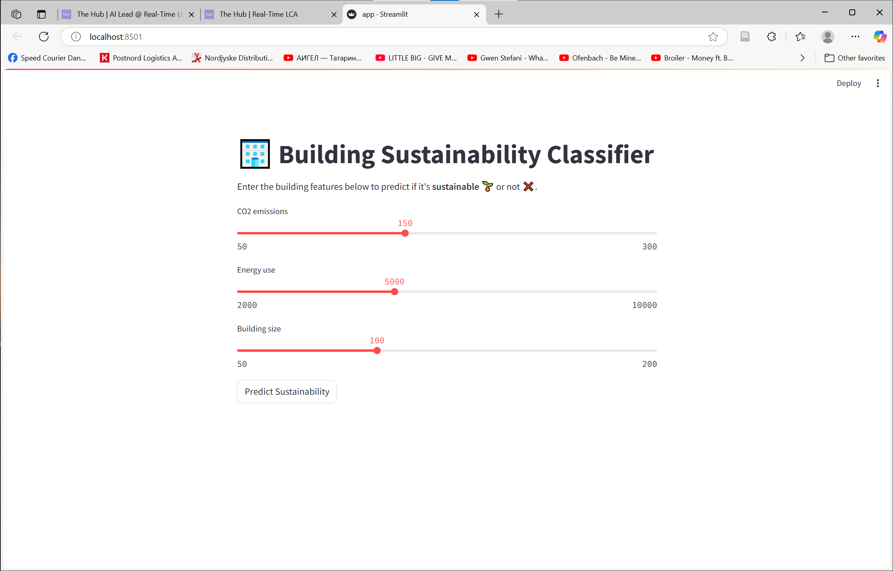

# 🏢 Building Sustainability Classifier

This is a machine learning project that predicts whether a building is sustainable or not, based on its **CO2 emissions**, **energy use**, and **size**.

It uses a **Decision Tree Classifier** trained on example CSV data.

---

## 🎯 Project Features

- Clean data from CSV
- Convert categorical labels to numeric
- Train/Test split (80/20)
- Predict new values
- Save model with `joblib`
- Streamlit web interface

---

## 📸 App Preview

Below is a screenshot of the app running with Streamlit:



---

## 📊 Model Accuracy

The model reaches **100% accuracy** on the small dataset provided.

Model accuracy: 1.0


---

## 🚀 Run the App Locally

Make sure you have Python and Streamlit installed:

```bash
pip install streamlit pandas scikit-learn joblib
streamlit run app.py
```

🧠 Model Details
Algorithm: Decision Tree

Input Features:

CO2_emissions

energy_use

building_size

Output:

sustainable (1 = Yes, 0 = No)

🗂 Files in This Project

+-------------------------------+----------------------------------------+
| File/Folder                   | Description                            |
+-------------------------------+----------------------------------------+
| app.py                        | Streamlit app                          |
| exploration.ipynb             | Jupyter Notebook exploration           |
| model.pkl                     | Saved ML model                         |
| data/buildings.csv            | Input dataset                          |
| images/banner_classifier_app.png | App screenshot                     |
| README.md                     | This file                              |
+-------------------------------+----------------------------------------+


💡 Author
David Silaghi – https://github.com/davidsilaghi18

